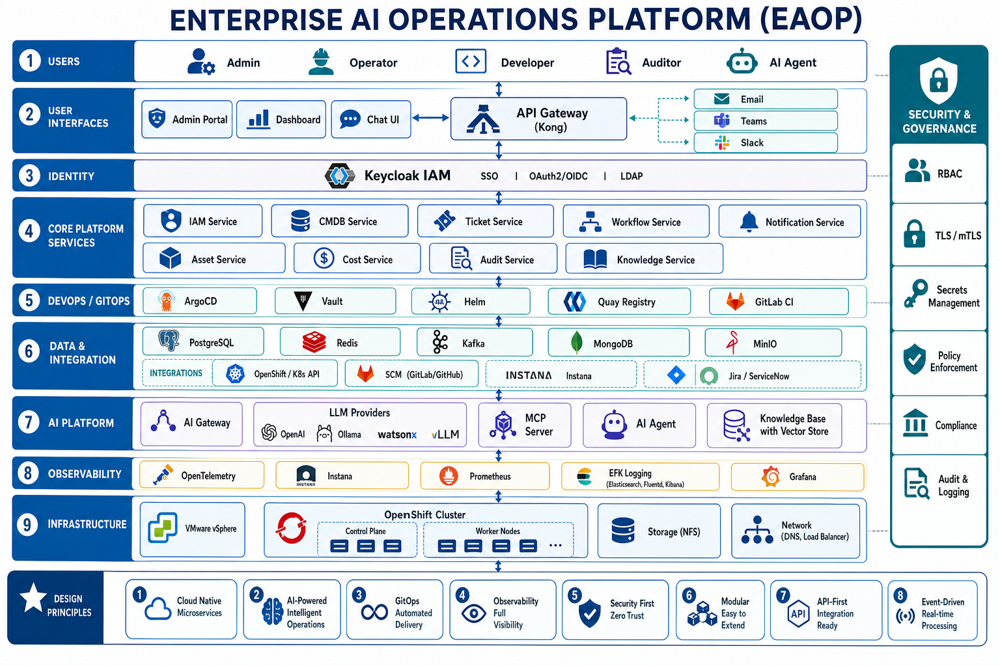

# Enterprise AI Operations Platform (EAOP)



## Giới thiệu

**Enterprise AI Operations Platform (EAOP)** — còn gọi là **Phoenix Platform** — là nền tảng vận hành và phát triển ứng dụng nội bộ doanh nghiệp, chạy trên **OpenShift/Kubernetes**. EAOP kết hợp **Internal Developer Platform (IDP)**, **IT Operations**, **GitOps** và **AI** trong một kiến trúc thống nhất.

Thay vì mỗi team tự dựng hạ tầng, tự cấu hình monitoring, tự xin quyền và tự tích hợp AI — developer chỉ cần vào **Admin Portal**, tạo application mới theo **Golden Path**, và platform tự động sinh toàn bộ cấu hình cần thiết rồi deploy qua **ArgoCD**.

**Cluster mục tiêu:** `ocp1.npd.co` · Storage: `nfs-csi` · GitOps: ArgoCD

---

## EAOP dùng để làm gì?

| Đối tượng | EAOP giúp gì |
|-----------|--------------|
| **Developer** | Tạo app mới self-service, không cần ticket infra. Nhận sẵn namespace, route, DB, cache, Kafka, monitoring. |
| **Platform / DevOps** | Chuẩn hóa Golden Path, GitOps, quota tài nguyên. Một nơi quản lý toàn bộ vòng đời app. |
| **Operator / SRE** | Dashboard, observability, audit log, ticket & workflow tích hợp. |
| **Admin / Security** | IAM (Keycloak), RBAC, audit, policy enforcement. |
| **AI / Automation** | AI Agent + MCP Server thao tác OpenShift, GitHub, CMDB, Ticket qua ngôn ngữ tự nhiên. |

### Vấn đề EAOP giải quyết

- **Không nhất quán** — mỗi team deploy khác nhau, khó bảo trì
- **Chậm** — chờ infra ticket vài ngày mới có môi trường
- **Thiếu visibility** — không biết app nào chạy đâu, ai sở hữu
- **AI rời rạc** — chatbot không kết nối được hệ thống vận hành thật

### Golden Path — luồng cốt lõi

```
Developer → Admin Portal → platform-api → Golden Path Engine
                ↓
    Sinh manifests (namespace, helm, argocd, route, keycloak, pg, redis, kafka, otel...)
                ↓
         GitOps repo → ArgoCD → OpenShift
```

---

## Thành phần hệ thống

### Lớp giao diện người dùng

| Thành phần | Mô tả | Trạng thái |
|------------|-------|------------|
| **Admin Portal** | Self-service tạo & provision application | ✅ Active |
| **Dashboard** | Tổng quan vận hành, metrics, health | Planned |
| **Chat UI** | Giao diện AI Assistant | Planned |

Tích hợp thông báo qua **Email**, **Microsoft Teams**, **Slack**.

### Lớp cổng & bảo mật

| Thành phần | Mô tả | Trạng thái |
|------------|-------|------------|
| **API Gateway (Kong)** | Routing, rate limit, auth plugin, API management | Planned |
| **IAM (Keycloak)** | SSO OAuth2/OIDC, user/role, LDAP/AD | Planned |
| **IAM Service** | API bọc Keycloak cho platform | Planned |

### Lớp dịch vụ nền tảng (Core)

| Thành phần | Mô tả | Trạng thái |
|------------|-------|------------|
| **platform-api** | Control plane — Golden Path, app registry, audit | ✅ Active |
| **Audit** | Nhật ký hành động, compliance | Partial |
| **Notification** | Cảnh báo đa kênh (email, Teams, Slack, webhook) | Planned |

### Lớp vận hành (Operations)

| Thành phần | Mô tả |
|------------|-------|
| **CMDB** | Quản lý cấu hình, asset, quan hệ phụ thuộc |
| **Ticket** | Incident, problem, change, service request |
| **Workflow** | Luồng phê duyệt, automation, policy |
| **Asset** | Hardware, software, license |
| **Cost** | Thu thập chi phí, chargeback |

### Lớp hạ tầng (Infrastructure)

| Thành phần | Mô tả |
|------------|-------|
| **Kubernetes Manager** | Tích hợp OpenShift/K8s API |
| **Cloud Manager** | VMware vSphere, tài nguyên cloud |

### Lớp AI

| Thành phần | Mô tả |
|------------|-------|
| **AI Gateway** | Proxy LLM (OpenAI, Ollama, Watsonx, vLLM), guardrails |
| **AI Agent** | NLP, hỗ trợ quyết định, thực thi hành động |
| **MCP Server** | Model Context Protocol — tools kết nối OCP, GitHub, CMDB |
| **Knowledge Base** | Runbook, SOP, wiki — vector store & semantic search |

### Lớp dữ liệu & tích hợp

| Thành phần | Vai trò |
|------------|---------|
| **PostgreSQL** | Database chính — app metadata, CMDB, ticket |
| **Redis** | Cache, session |
| **Kafka** | Event bus — `application.created`, `workflow.approved`, `ai.action.requested` |
| **MongoDB** | AI conversations, chat sessions |
| **MinIO** | Object storage — documents, runbooks, backup |

### Lớp GitOps & DevOps

| Thành phần | Vai trò |
|------------|---------|
| **ArgoCD** | GitOps continuous delivery |
| **Helm** | Package management |
| **Vault** | Secrets management |
| **GitLab CI / GHCR** | CI/CD, container registry |

### Lớp Observability

| Thành phần | Vai trò |
|------------|---------|
| **OpenTelemetry** | Traces, metrics, logs |
| **Prometheus + Grafana** | Metrics & dashboards |
| **Instana** | APM, service mapping |
| **EFK / OpenSearch** | Log aggregation & search |

### Hạ tầng triển khai

| Thành phần | Spec |
|------------|------|
| **OpenShift** | 3 master + 3 worker (4 vCPU, 16 GB RAM mỗi node) |
| **DNS** | `ocp1.npd.co` |
| **Storage** | NFS CSI (`nfs-csi`), 200 GB |
| **Network** | OpenShift Router, TLS edge termination |

---

## Nguyên tắc thiết kế

1. **Cloud-native microservices** — dịch vụ nhỏ, deploy độc lập
2. **AI-powered intelligent operations** — AI tích hợp vào quy trình vận hành
3. **GitOps automated delivery** — Git là source of truth, ArgoCD sync
4. **Observability full visibility** — metrics, logs, traces end-to-end
5. **Security first (Zero Trust)** — RBAC, mTLS, secrets, audit
6. **Modular** — dễ mở rộng template, service, integration mới
7. **API-first** — mọi capability expose qua REST API
8. **Event-driven** — Kafka cho xử lý real-time

---

## Trạng thái triển khai

| Phase | Phạm vi | Trạng thái |
|-------|---------|------------|
| **1** | Golden Path, platform-api, Admin Portal | ✅ Done |
| **2** | GitOps push, ArgoCD sync app lên OpenShift | 🟡 In progress |
| **3** | AI Gateway, MCP Server, Chat UI | Planned |
| **4+** | CMDB, Ticket, Workflow, Cost, ... | Planned |

---

## Cấu trúc repository

```
apps/                    # Admin Portal, Dashboard, Chat UI
services/platform-api/   # Control plane + Golden Path
services/core/           # IAM, Audit, Notification
services/operations/     # CMDB, Ticket, Workflow, Asset, Cost
services/infrastructure/ # K8s Manager, Cloud Manager
services/ai/             # AI Gateway, Agent, MCP, Knowledge
deploy/openshift/        # Manifests OpenShift
gitops/                  # ArgoCD manifests
templates/golden-path/   # Provisioning templates
docs/                    # Architecture + service specs
```

Chi tiết: [docs/REPOSITORY_STRUCTURE.md](docs/REPOSITORY_STRUCTURE.md) · [docs/services/](docs/services/)

---

## Triển khai trên OpenShift

Xem [deploy/README.md](deploy/README.md).

```bash
oc login --token=... --server=https://api.ocp1.npd.co:6443

oc apply -f deploy/openshift/namespaces/
oc apply -f deploy/openshift/phoenix-platform/infra/
oc apply -f deploy/openshift/phoenix-platform/builds/

oc start-build platform-api --from-dir=. --wait -n phoenix-platform
oc start-build admin-portal --from-dir=. --wait -n phoenix-platform

oc apply -f deploy/openshift/phoenix-platform/apps/
```

### Routes

| Service | URL |
|---------|-----|
| Admin Portal | https://portal.ocp1.npd.co |
| Platform API | https://api.platform.ocp1.npd.co |
| API Docs | https://api.platform.ocp1.npd.co/docs |

---

## License

MIT — see [LICENSE](LICENSE).
